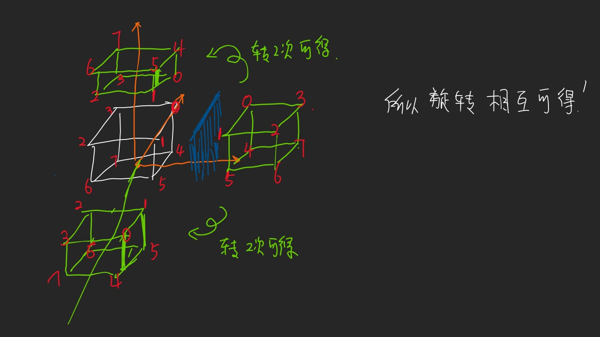
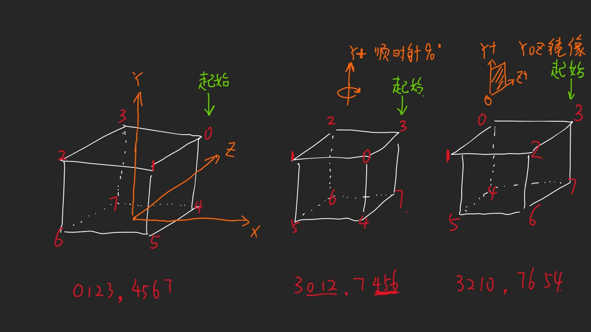

参考链接在最下方
# 笔记

# 参考链接
## Stage 1 
六边形网格网站
https://www.redblobgames.com/grids/hexagons/ 
## Stage 2
MarchingCube参考视频 
https://www.youtube.com/watch?v=M3iI2l0ltbE 

论文：
[https://people.eecs.berkeley.edu/~jrs/meshpapers/LorensenCline.pdf
## Stage 4
波函数坍缩参考视频
https://www.youtube.com/watch?v=2SuvO4Gi7uY&t=246s 

Oskar Demo链接：
https://oskarstalberg.com/game/wave/wave.html

